# Гра "Шашки"

## Опис функціональності

### 🖥️ Інтерфейс користувача (UI)
1. Головне меню:
    - Вибір стилю: Класичні шашки або Стилізовані [★](https://github.com/Doshik143/Checkers_Game/blob/game/Checkers/Views/GameSettingsForm.cs.cs#L62-L82)
    - Вибір противника (комп'ютер або людина) [★](https://github.com/Doshik143/Checkers_Game/blob/game/Checkers/Views/GameSettingsForm.cs.cs#L84-L123)
    - Вибір кольору шашок (чорні, білі або рандом) [★](https://github.com/Doshik143/Checkers_Game/blob/game/Checkers/Views/GameSettingsForm.cs.cs#L125-L158)
    - Вибір складності (тільки проти комп'ютера) [★](https://github.com/Doshik143/Checkers_Game/blob/game/Checkers/Views/GameSettingsForm.cs.cs#L160-L179)
2. Меню під час гри:
    - Нова гра [★](https://github.com/Doshik143/Checkers_Game/blob/game/Checkers/Controllers/GameController.cs#L36-L60)
    - Збереження гри (у JSON-файл) [★](https://github.com/Doshik143/Checkers_Game/blob/game/Checkers/Controllers/GameController.cs#L120-L138)
    - Завантаження збереженої гри [★](https://github.com/Doshik143/Checkers_Game/blob/game/Checkers/Controllers/GameController.cs#L140-L160)
    - Турнірний режим [★](https://github.com/Doshik143/Checkers_Game/blob/game/Checkers/Views/MainForm.cs#L371-L381)
    - Переглянути статистику [★](https://github.com/Doshik143/Checkers_Game/blob/game/Checkers/Views/MainForm.cs#L97-L102)
    - Скасувати останній хід [★](https://github.com/Doshik143/Checkers_Game/blob/game/Checkers/Controllers/GameController.cs#L162-L177)
    - Вихід з програми [★](https://github.com/Doshik143/Checkers_Game/blob/game/Checkers/Views/MainForm.cs#L74)
3. Ігрове поле:
    - Дошка 8x8 з класичними кольорами [★](https://github.com/Doshik143/Checkers_Game/blob/game/Checkers/Views/MainForm.cs#L114-L127)
    - Відображення шашок обох гравців, у т.ч. дамок [★](https://github.com/Doshik143/Checkers_Game/blob/game/Checkers/Views/MainForm.cs#L129-L188)
    - Підсвічування можливих ходів вибраної шашки [★](https://github.com/Doshik143/Checkers_Game/blob/game/Checkers/Views/MainForm.cs#L255-L274)
    - Вказівка, чия черга ходу [★](https://github.com/Doshik143/Checkers_Game/blob/game/Checkers/Views/MainForm.cs#L293-L317s)
    - Окреме оформлення шашок у режимі "Хвостики" (анімована ковбаса та кіт) [★](https://github.com/Doshik143/Checkers_Game/blob/game/Checkers/Views/MainForm.cs#L190-L253)
4. Екран завершення гри:
    - Виведення переможця гри [★](https://github.com/Doshik143/Checkers_Game/blob/game/Checkers/Views/GameOverForm.cs#L11-L34)
    - Варіанти дій: почати нову гру або вийти з програми [★](https://github.com/Doshik143/Checkers_Game/blob/game/Checkers/Views/GameOverForm.cs#L36-L57)
### 🎯 Ігрова логіка
1. Початок гри:
    - Ініціалізація поля та розміщення шашок [★](https://github.com/Doshik143/Checkers_Game/blob/game/Checkers/Models/Board.cs#L17-L30)
    - Можливість обрати гравця, який ходить першим [★](https://github.com/Doshik143/Checkers_Game/blob/game/Checkers/Controllers/GameController.cs#L36-L60)
    - Якщо гравець обрав чорні шашки проти AI — AI робить перший хід [★](https://github.com/Doshik143/Checkers_Game/blob/game/Checkers/Controllers/GameController.cs#L62-L83)
2. Механіка гри:
    - Рух шашок лише по діагоналі [★](https://github.com/Doshik143/Checkers_Game/blob/game/Checkers/Models/Board.cs#L142-L235)
    - Можливість захоплення шашки суперника [★](https://github.com/Doshik143/Checkers_Game/blob/game/Checkers/Models/Board.cs#L35-L81)
    - Автоматичне перетворення в дамку на останньому ряду [★](https://github.com/Doshik143/Checkers_Game/blob/game/Checkers/Models/Board.cs#L42-L46)
    - Обов’язкове взяття: якщо можна "бити" — хід без взяття не дозволяється [★](https://github.com/Doshik143/Checkers_Game/blob/game/Checkers/Models/Board.cs#L93-L111)
    - Дамка може ходити в усіх напрямках по діагоналі, включно з багатоходовими захопленнями [★](https://github.com/Doshik143/Checkers_Game/blob/game/Checkers/Models/Board.cs#L173-L235)
    - Якщо є ще одне захоплення — автоматично надається можливість продовжити комбінацію [★](https://github.com/Doshik143/Checkers_Game/blob/game/Checkers/Models/Game.cs#L62-L96)
    - Чергування ходу між гравцями або гравцем і AI [★](https://github.com/Doshik143/Checkers_Game/blob/game/Checkers/Models/Game.cs)
3. Завершення гри:
    - Перемога: якщо у суперника немає ходів або немає шашок [★](https://github.com/Doshik143/Checkers_Game/blob/game/Checkers/Models/Game.cs#L138-L183)
    - Нічия при патовій ситуації [★](https://github.com/Doshik143/Checkers_Game/blob/game/Checkers/Models/Game.cs)
4. Гра з комп'ютером:
    - Реалізовано AI з 4 рівнями складності (легкий, середній, складний, профі) [★](https://github.com/Doshik143/Checkers_Game/blob/game/Checkers/Models/Game.cs#L15-L60)
    - AI надає пріоритет захопленням, багатоходовим комбінаціям, та униканню вразливих позицій [★](https://github.com/Doshik143/Checkers_Game/blob/game/Checkers/Models/Game.cs#L159-L289)
### 💾 Збереження та завантаження гри
- Збереження в JSON-файл: поточна дошка, шашки, активний гравець, дамки, хід [★](https://github.com/Doshik143/Checkers_Game/blob/game/Checkers/Services/GameSaver.cs#L21-L46)
- Завантаження гри: з меню [★](https://github.com/Doshik143/Checkers_Game/blob/game/Checkers/Services/GameSaver.cs#L48-L94)
- Історія ходів зберігається для можливості їх скасування [★](https://github.com/Doshik143/Checkers_Game/blob/game/Checkers/Models/Game.cs#L98-L136)
### 🧩 Додаткові функції
1. Турнірний режим:
    - Вибір кількості ігор (від 2 до 100) [★](https://github.com/Doshik143/Checkers_Game/blob/game/Checkers/Views/TournamentForm.cs#L20-L38)
    - Автоматичне чергування партій [★](https://github.com/Doshik143/Checkers_Game/blob/game/Checkers/Controllers/TournamentManager.cs#L26-L39)
    - Підрахунок перемог кожної сторони [★](https://github.com/Doshik143/Checkers_Game/blob/game/Checkers/Views/TournamentStatusForm.cs)
    - Завершальний екран з результатом турніру та переможцем [★](https://github.com/Doshik143/Checkers_Game/blob/game/Checkers/Views/TournamentResultsForm.cs)
2. Скасування ходу:
    - Гравець може повернути останній хід [★](https://github.com/Doshik143/Checkers_Game/blob/game/Checkers/Models/Game.cs#L98-L104)
    - У режимі проти AI — відкат двох останніх ходів (гравця та AI) [★](https://github.com/Doshik143/Checkers_Game/blob/game/Checkers/Controllers/GameController.cs#L162-L177)
3. Ведення статистики:
    - Кількість перемог білих шашок, чорних шашок, нічиїх [★](https://github.com/Doshik143/Checkers_Game/blob/game/Checkers/Models/GameStatistics.cs#L16-L32)
    - Сумарний час гри [★](https://github.com/Doshik143/Checkers_Game/blob/game/Checkers/Models/GameStatistics.cs#L30)
    - Дата останньої гри [★](https://github.com/Doshik143/Checkers_Game/blob/game/Checkers/Models/GameStatistics.cs#L31)
    - Зберігання у файл stats.dat та завантаження [★](https://github.com/Doshik143/Checkers_Game/blob/game/Checkers/Models/GameStatistics.cs#L34-L52)
4. Різні стилі гри:
    - Класичні шашки (чорні та білі)
    - Стиль "Хвостики" (ковбаса та хвостики)
    - Передача стилю [★](https://github.com/Doshik143/Checkers_Game/blob/game/Checkers/Views/MainForm.cs#L351-L355)

---

## Запуск Локально

## Вимоги
- .NET Framework 4.7.2 або новіше
- Windows OS
## Встановлення
1. Клонуйте репозиторій
2. Відкрийте `CheckersGame.sln` у Visual Studio
3. Зіберіть і запустіть проект

---

## 📐 Programming Principles

| Принцип | Реалізація | Коментар |
|--------|-------------|----------|
| **SRP (Single Responsibility Principle)** | [`Game`](https://github.com/Doshik143/Checkers_Game/blob/game/Checkers/Models/Game.cs), [`GameController`](https://github.com/Doshik143/Checkers_Game/blob/game/Checkers/Controllers/GameController.cs), [`GameSaver`](https://github.com/Doshik143/Checkers_Game/blob/game/Checkers/Services/GameSaver.cs), [`MainForm`](https://github.com/Doshik143/Checkers_Game/blob/game/Checkers/Views/MainForm.cs) | Кожен клас відповідає за свою окрему відповідальність |
| **OCP (Open/Closed Principle)** | [`AIService`](https://github.com/Doshik143/Checkers_Game/blob/game/Checkers/Services/AIService.cs) підтримує додавання нових стратегій без змін старих | Добре структурований метод [`GetBestMove()`](https://github.com/Doshik143/Checkers_Game/blob/game/Checkers/Services/AIService.cs#L17-L60) |
| **LSP (Liskov Substitution Principle)** | [`Piece`](https://github.com/Doshik143/Checkers_Game/blob/game/Checkers/Models/Piece.cs), [`Move`](https://github.com/Doshik143/Checkers_Game/blob/game/Checkers/Models/Move.cs) використовуються взаємозамінно | Всі компоненти гри очікувано поводяться |
| **ISP (Interface Segregation Principle)** | Класи не мають зайвих методів | Інтерфейси не перевантажені |
| **DIP (Dependency Inversion Principle)** | Частково — залежності створюються в контролері | Можна покращити через DI |
| **DRY** | `Clone()` → [1](https://github.com/Doshik143/Checkers_Game/blob/game/Checkers/Models/Piece.cs#L33-L39) → [2](https://github.com/Doshik143/Checkers_Game/blob/game/Checkers/Models/Board.cs#L243-L254), [`SaveState()`](https://github.com/Doshik143/Checkers_Game/blob/game/Checkers/Models/Game.cs#L106-L117) | Уникає дублювання логіки |
| **KISS** | Простий, логічний код | Чіткий поділ між UI, логікою та збереженням |
| **YAGNI** | Впроваджено лише необхідні функції | Немає зайвих абстракцій |
| **Encapsulation** | Поля в [`Piece`](https://github.com/Doshik143/Checkers_Game/blob/game/Checkers/Models/Piece.cs#L8-L18), Приватні поля в [`Board`](https://github.com/Doshik143/Checkers_Game/blob/game/Checkers/Models/Board.cs#L12-L13), тощо | Доступ лише через методи |

---

## 🎨 Design Patterns

| Патерн | Приклад | Коментар |
|--------|---------|----------|
| **MVC (Model-View-Controller)** | [`MainForm`](https://github.com/Doshik143/Checkers_Game/blob/game/Checkers/Views/MainForm.cs) (View), [`GameController`](https://github.com/Doshik143/Checkers_Game/blob/game/Checkers/Controllers/GameController.cs) (Controller), [`Game`](https://github.com/Doshik143/Checkers_Game/blob/game/Checkers/Models/Game.cs), [`Board`](https://github.com/Doshik143/Checkers_Game/blob/game/Checkers/Models/Board.cs) (Model) | Класична архітектура |
| **Command (спрощений)** | [Undo через `GameState`](https://github.com/Doshik143/Checkers_Game/blob/game/Checkers/Models/Game.cs#L98-L136) | Історія команд у стеку |
| **Observer (через події)** | [`GameController.OnGameFinished`](https://github.com/Doshik143/Checkers_Game/blob/game/Checkers/Controllers/GameController.cs#L116) | Інформування про завершення гри |
| **Strategy (частково)** | AI через [`switch-case`](https://github.com/Doshik143/Checkers_Game/blob/game/Checkers/Services/AIService.cs#L47-L59) по складності | Можна винести в окремі класи |
| **Template Method** | `MakeMove()` у [`Game`](https://github.com/Doshik143/Checkers_Game/blob/game/Checkers/Models/Game.cs#L62-L96) | Послідовність дій ходу |
| **Factory (потенційно)** | Можна винести створення AI за рівнями | Ще не реалізовано явно |
| **DTO** | [`GameState`](https://github.com/Doshik143/Checkers_Game/blob/game/Checkers/Models/GameState.cs), [`MoveInfo`](https://github.com/Doshik143/Checkers_Game/blob/game/Checkers/Services/GameSaver.cs#L123-L144), [`PieceInfo`](https://github.com/Doshik143/Checkers_Game/blob/game/Checkers/Services/GameSaver.cs#L106-L121) | Для передачі даних без поведінки |
| **Singleton (імпліцитний)** | [`GameStatistics.LoadFromFile(...)`](https://github.com/Doshik143/Checkers_Game/blob/game/Checkers/Models/GameStatistics.cs#L43-L52) | Один об'єкт статистики зберігається/читається |

---

## 🛠️ Refactoring Techniques

| Техніка | Приклад | Коментар |
|--------|---------|----------|
| **Extract Method** | [`DrawBoard()`](https://github.com/Doshik143/Checkers_Game/blob/game/Checkers/Views/MainForm.cs#L114-L127), [`DrawPieces()`](https://github.com/Doshik143/Checkers_Game/blob/game/Checkers/Views/MainForm.cs#L129-L188), [`DrawValidMoves()`](https://github.com/Doshik143/Checkers_Game/blob/game/Checkers/Views/MainForm.cs#L255-L274) | Полегшення читабельності |
| **Extract Class** | [`AIService`](https://github.com/Doshik143/Checkers_Game/blob/game/Checkers/Services/AIService.cs), [`GameSaver`](https://github.com/Doshik143/Checkers_Game/blob/game/Checkers/Services/GameSaver.cs), [`TournamentManager`](https://github.com/Doshik143/Checkers_Game/blob/game/Checkers/Controllers/TournamentManager.cs) | Розділення обов'язків |
| **Encapsulate Field** | `_pieces` в [`Board`](https://github.com/Doshik143/Checkers_Game/blob/game/Checkers/Models/Board.cs#L13) | Прямий доступ заборонений |
| **Replace Magic Number** | [`Board.Size`](https://github.com/Doshik143/Checkers_Game/blob/game/Checkers/Models/Board.cs#L10), [`CellSize`](https://github.com/Doshik143/Checkers_Game/blob/game/Checkers/Views/MainForm.cs#L11) | Покращена зрозумілість |
| **DTO (Data Transfer Object)** | [`MoveInfo`](https://github.com/Doshik143/Checkers_Game/blob/game/Checkers/Services/GameSaver.cs#L123-144), [`PieceInfo`](https://github.com/Doshik143/Checkers_Game/blob/game/Checkers/Services/GameSaver.cs#L106-L121) | Для серіалізації |
| **Clone Instead of Manual Copy** | [`Piece.Clone()`](https://github.com/Doshik143/Checkers_Game/blob/game/Checkers/Models/Piece.cs#L33-L39), [`Board.Clone()`](https://github.com/Doshik143/Checkers_Game/blob/game/Checkers/Models/Board.cs#L243-L254) | Для збереження станів |
| **Use of Stack for Undo** | `_history` в [`Game`](https://github.com/Doshik143/Checkers_Game/blob/game/Checkers/Models/Game.cs#L32) | Проста реалізація історії гри |
| **Early Return** | `if (IsGameOver) return;` → [1](https://github.com/Doshik143/Checkers_Game/blob/game/Checkers/Models/Game.cs#L38) → [2](https://github.com/Doshik143/Checkers_Game/blob/game/Checkers/Models/Game.cs#L64) → [3](https://github.com/Doshik143/Checkers_Game/blob/game/Checkers/Models/Game.cs#L100)→ [4](https://github.com/Doshik143/Checkers_Game/blob/game/Checkers/Controllers/GameController.cs#L87-L88) | Зниження вкладеності |

---

## 📌 Рекомендації

- 🔁 Впровадити **DI-контейнер** (наприклад Autofac або Microsoft.Extensions.DependencyInjection)
- ♟️ Винести логіку AI по рівнях у окремі стратегії (**Strategy Pattern**)
- 🏭 Використати **Factory Pattern** для створення AI, гри, налаштувань
- 📊 Можна реалізувати **Observer/EventAggregator** для розширення подій

---

## 🔢 Code Stats

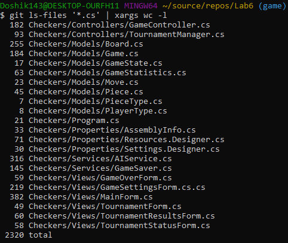

---

## 📸 Скріншоти

### 🎮 Головне меню гри (Нова гра)

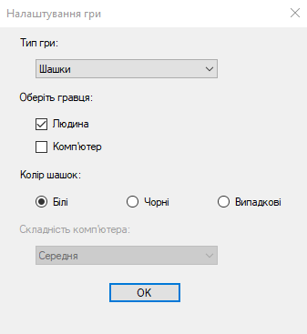

### ♟️ Ігрове поле (класичний стиль)

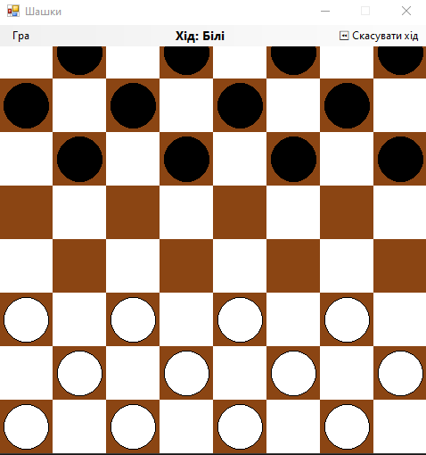

### 🐾 Ігрове поле (стиль "Хвостики")

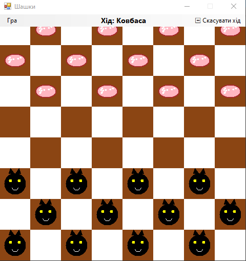

### 🗂️ Вигляд меню під час гри

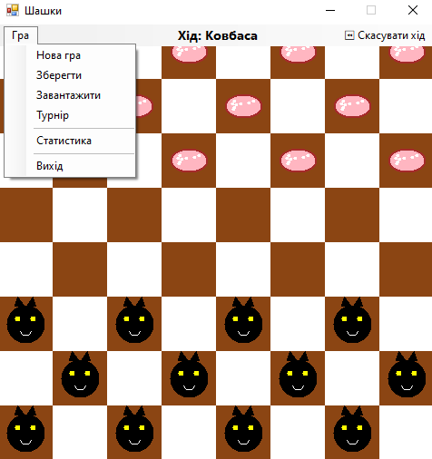

### ✨ Підсвічування ходу шашки

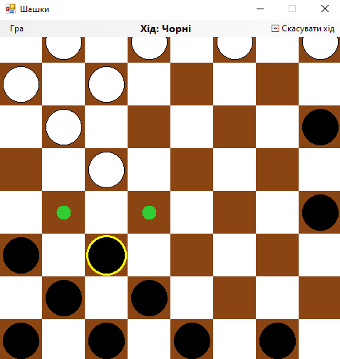

### 🥇 Виведення переможця

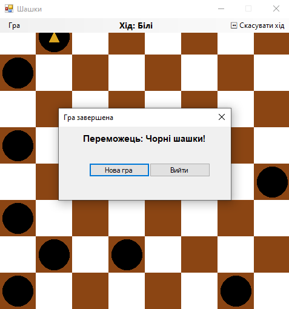

### 📊 Статистика гравця

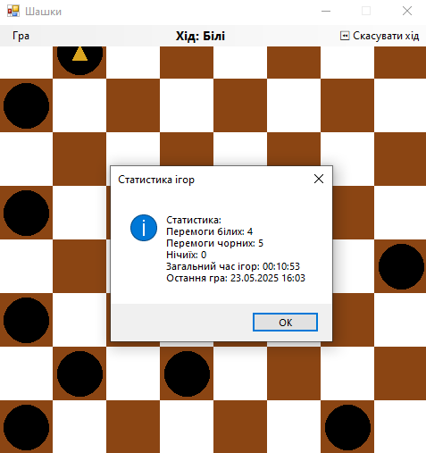

## 🛠️ Налаштування турніру

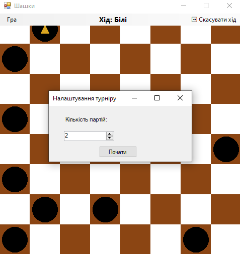

## 🏆 Проведення турніру

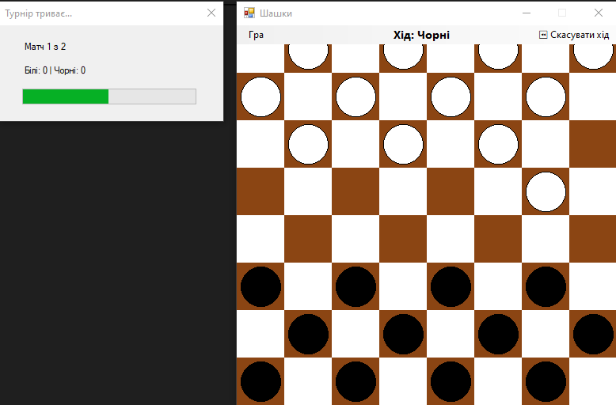

## 🏁 Завершення турніру

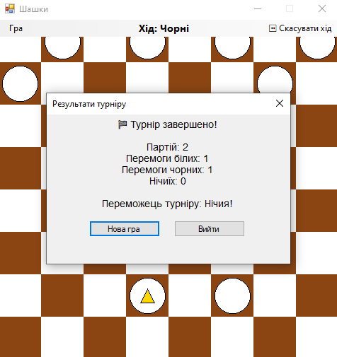